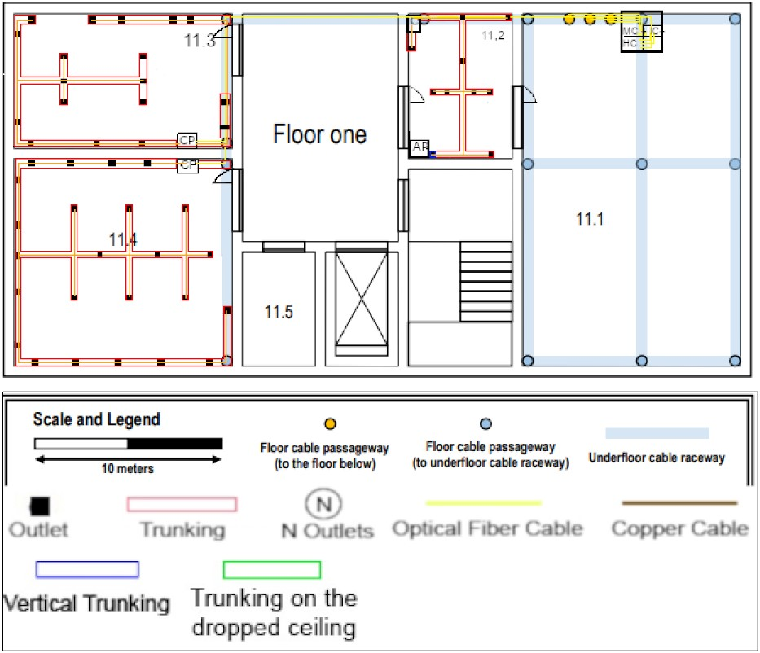
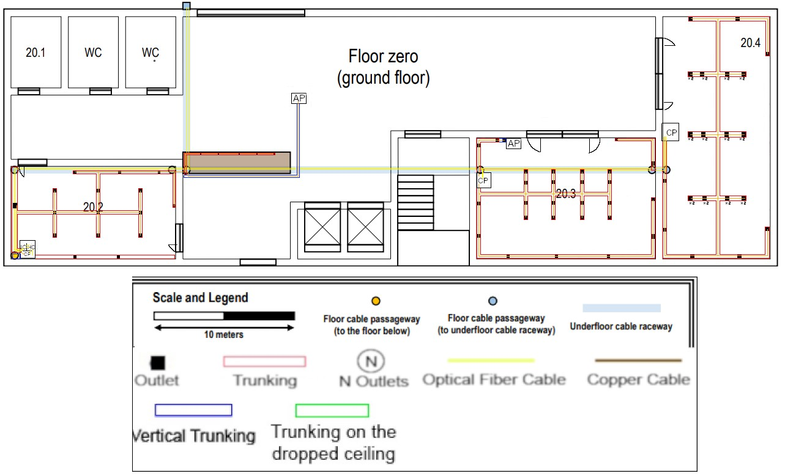

RCOMP 2020-2021 Project - Sprint 1 - Member 1121224 folder
===========================================

## Building 1 ####
##### João Soares - 1121224 ###

###Building 1 -  Floor One


####Scale
```
 4cm -> 10 meters
 2cm -> 5 meters

 Area of room 
 2 --- 5
 measure --- x

<=> (x = measure * 5)/2
```

## Floor inventory

>#####For every length of cable calculated, it was taken into account the correct scale and necessary cable lenght inside telecomunication enclosures.


* ####Copper Cabble (T-568A)
>665 meters for the rest of the rooms on the first floor
> 
* ####Fibre Cable
>Taking into consideration the redundacy needed to ensure safety and continuous signal to the building itself, twice the amount of fibre cable will be requested. 
>
>As so, to make every connection and keep them redundant, **358 meters** of fibre cable will be necessary.
* ####Floor Trunking
>This type of trunking should be rounded, to prevent accidents in the various rooms it is placed in.
>
>#####120 meters

* ####Vertical Trunking
>Again, this type of trunking is to the client's taste, as it is meant to stay on the wall and should not cause much trouble.
>
>#####3 meters
* ####Access points
>The access points will be responsible for providing wireless internet coverage of the entire floor.
>
>The type of access point used provides a reach of 50 meters around it, as so, only 2 were necessary to cover the building. 
>However, it would be advised (for a stronger connection ground wide) to use more AP's with smaller but stronger connection power.
>
>#####Total = 1 Access Point
* ####Outlets
>Following the industry standards, for the  the client will need 51 outlets.

* ####Telecomunication Enclosures
>For this floor, there will be 3 telecomunication enclosures.
>
>
> **Number 1(11.1)** will hold 3 devices (1 24 patch panels for the MC, 1 24 patch panels for the IC and 1 24 patch panels for the HC) so, it's size will be 6 * 3 U (S) = **18U**.
>
> **Number 2(11.2)** will hold 1 devices (1 24 patch panels for the CP's), it's size will be 6 * 1 = **6U**.
>
> **Number 3(11.3)** will hold 1 devices (1 24 patch panels for the CP's), it's size will be 6 * 1 = **6U**.
>
> **Number 4(11.4)** will hold 1 devices (1 48 patch panels for the CP's), it's size will be 6 * 2 = **12U**.
>
>
>#####TE #1 -> 18U
>#####TE #2 -> 6U
>#####TE #3 -> 6U
>#####TE #3 -> 12U

###To sum up and explain every connection and decision made, 
This floor is made up of 1Mc,1 IC, 1 HC and 3 CP's.
The CP on the room 11.4 had to support more than 24 cables, so it was decided a 48 patch panel was better to accomodate the needs of the room.
The acess point was placed in a spot where the whole floor will have a good coverage via Wi-Fi connection. 
Every fiber connection was made using redundancy to ensure good connection.

#Full inventory Building 1 Floor 1

####Copper Cable 
> ** 640  meters of S/UTP protected cable**
> **25 meters of S/STP protected cable** 
####Fiber Cable
> **358 meters**
####Floor Trunking
> **120 meters**
####Vertical Trunking
> **3 meters**
####Access Points
> **1 Access Point**
####Outlets
> **51 outlets**
####Telecomunication Enclosures
> **3 total telecomunication enclosures**
>
>**Room 11.2 - TE 1 - 6U**  
>
>**Room 11.3 - TE 2 - 6U**  
>
>**Room 11.4 - TE 2 - 12U**
>

## Building 2 - Ground Floor ####
 
 
 ## Floor inventory

* ####Copper Cabble (T-568A)
>For all the rooms in the ground floor.
> #####1295 meters total
* ####Fibre Cable
>Taking into consideration the redundacy needed to ensure safety and continuous signal to the building itself, twice the amount of fibre cable will be requested. 
>
>As so, to make every connection and keep them redundant, **372 meters** of fibre cable will be necessary.
* ####Floor Trunking
>This type of trunking should be rounded, to prevent accidents in the various rooms it is placed in.
>
>#####148 meters

* ####Vertical Trunking
>Again, this type of trunking is to the client's taste, as it is meant to stay on the wall and should not cause much trouble.
>
>#####12 meters
* ####Access points
>The access points will be responsible for providing wireless internet coverage of the entire floor.
>
>The type of access point used provides a reach of 50 meters around it, as so, only 1 was necessary to cover the building. 
>However, it would be advised (for a stronger connection ground wide) to use more AP's with smaller but stronger connection power.
>
>#####2 Access Point
* ####Outlets
>Following the industry standards, for this floor 71 outlets are required, being that one of them is for the Access Point.
>#####60 Outlets in total
* ####Telecomunication Enclosures
>For this floor, there will be 3 telecomunication enclosures.
>
>**Number 1** (Room 20.2) will hold 3 devices (1 24 patch panel for the IC, 1 24 patch panel for the HC and 1 24 patch panel for the CP), so, it's size will be 6 * 3U (S) = **18U**.
>
>**Number 2** (Room 20.3) will hold 1 device (1 48 patch panels for the CP), it's size will be 6 * 2U (48 patch panels ocuppy 2U) = **12U**.
>
>**Number 3** (Room 20.4) will hold 1 device (1 48 patch panels for the CP), it's size will be 6 * 2U (48 patch panels ocuppy 2U) = **12U**.
>
>#####To sum up, 
>#####TE #1 -> 18U
>#####TE #2 -> 12U
>#####TE #3 -> 12U

###To sum up and explain every connection and decision made,
This floor is only requires outlets in some of the rooms, so its easy to route. smaller.Room 20.2 contains the IC, HC and a CP, which means it powers the entire floor. There are 2 Access Points, to provide full Wi-Fi support throughout all the floor's area.
Rooms 20.3 and 20.4 are quite outlet heavy, thus a 48 cp will be provided to each room to accomodate those necessities.
For even better redundance , the HC from Room 20.2 is connected to the HC directly above.

#Full inventory Building 2

####Copper Cable 
> ** 1255  meters of S/UTP protected cable**
>
> **40,50 meters of S/STP protected cable** 
####Fiber Cable
> **583 meters**
####Floor Trunking
> **148 meters**
####Vertical Trunking
> **12 meters**
####Access Points
> **2 Access Points**
####Outlets
> **71 outlets**
####Telecomunication Enclosures
> **3 total telecomunication enclosures**
>
>**Room 20.2 - TE 1 - 18U**  
>
>**Room 20.3 - TE 2 - 12U**  
>
>**Room 20.4 - TE 2 - 12U**
>


###Demonstration of calculations regarding the number of network outlets for each building

####Ground Floor
>**Room 11.2**
>   >2.2cm x 3.2cm
>   ><=>5.5 x 8.5 <=> 44 m2
>
>
>######9 Outlets

>**Room 11.3**
>   >3cm x 4.7cm
>   ><=>7.5 x 11.75 <=> 88,125 m2
>
>######18 Outlets


>**Room 11.4**
 >   >4.5cm x 4.5cm
 >   ><=>11.25 x 11.25 <=> 126,5 m2
 >
 >
 >######24 Outlets


####Ground Floor Building 2

>**20.2**
 >   >2cm x 3.5cm
 >   ><=>6.7 x 11.7 <=> 78.39 m2
 >
 >
 >######16 Outlets

>**20.3**
 >   >3cm x 4cm
 >   ><=>10 x 13.33 <=> 133.3 m2
 >
 >
 >######27 Outlets

>**20.4**
 >   >5.5cm x 2.5cm
 >   ><=>8.33 x 18.33 <=> 74.75 m2
 >
 >
 >######31 Outlets