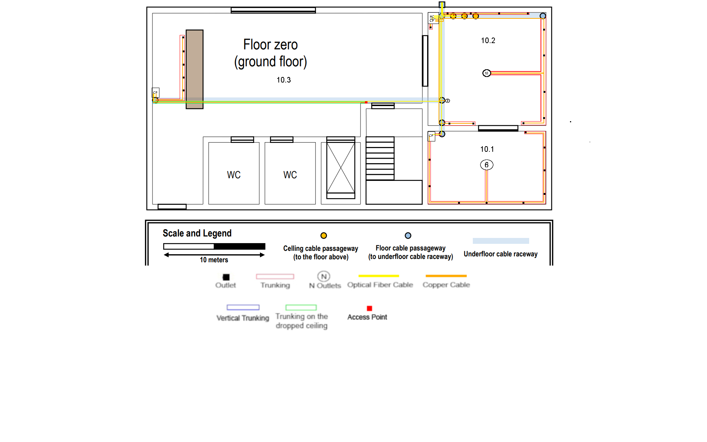

RCOMP 2020-2021 Project - Sprint 1 - Member 1181597 folder
===========================================

## Building 1 Ground Floor and Building 2 Floor One ####
##### Rui Alves - 1181597 ###

###Building 1 - Ground Floor



####Scale
```
 7.5cm -> 10 meters
 1cm -> 1.3(3) meters

 Area of room 
 1cm --- 1.3(3) meters 
 measure --- x

<=> (x = measure * 1.3(3))/1

r = 1.3(3)
```

## Floor inventory

>#####For every length of cable calculated, it was taken into account the correct scale and necessary cable lenght inside telecomunication enclosures.


* #### HC
> HC receives 2 Optical fiber cables from the IC and another 2 from the closest HC on the floor above and has a 24 patch cord on a fiber patch panel with 6 optical fiber cables, each 2 connected to a CP from all CPs in this floor to guarantee redundance.
	> ##### CP on Room 10.1 (with a copper patch panel with 24 copper patch cords)
	> *###### 'Input': 2 optical fiber cables - (0.5 + 13.1) x 2 = 27.2 meters
	> *####### 'Output': 15 copper cables spread around the room. 7.5 meters of S/STP copper cables + 214.8 meters of S/UTP copper cables.
	> Trunking: 26.7 meters (excess).
 
	> ##### CP on Room 10.2 (with a copper patch panel with 48 copper patch cords)
	> *###### 'Input': 2 optical fiber cables - 0.5 x 2 = 1 meter
	> *####### 'Output': 24 copper cables spread around the room. 12 meters of S/STP copper cables + 342.5 meters (excess) of S/UTP copper cables.
	> Truncking: 29.0 meters (excess).

	> ##### CP on Room 10.3 (with a copper patch panel with 24 copper patch cords)
	> *###### 'Input': 2 optical fiber cables - 38.55 x 2 = 77.10 meters (excess)
	> *####### 'Output': 24 copper cables spread around the room. 2.5 meters of S/STP copper cables + 32 meters (excess) of S/UTP copper cables.
	> Truncking: 33.6 meters (excess).
	
* ####Copper Cable
> #####612 meters (excess) total (589.3 meters of S/UTP and 22 meters of S/STP)
* ####Fibre Cable
> #####106 meters (excess) total
 >Taking into consideration the redundacy needed to ensure safety and continuous signal to the building itself, twice the amount of fibre cable will be requested.
>
>As so, to make every connection and keep them redundant, **190 meters** of fibre cable will be necessary.
* ####Floor Trunking
> #####90 meters (excess) total
>This type of trunking should be rounded, to prevent accidents in the various rooms it is placed in.
>
* ####Access point
>The access point will be responsible for providing wireless internet coverage of the entire floor.
>
>The type of access point used provides a reach of 50 meters around it, as so, only 1 necessary to cover the floor. 
>However, it would be advised (for a stronger connection ground wide) to use more AP's with smaller but stronger connection power.
>
>#####2 Access Points
* ####Outlets
>Following the industry standards, for standards there is a minimum of two outlets per work area, and also a ratio of two outlets for each 10 square meters of area.
> For 10.1, with 7 meters from with and 11.25 meters length, that gives an area of about 78.75m2, the number of outlets should be area/10*2, that gives us 15 outlets, by excess.
> For 10.2, with 10.15 meters from with and 11.25 meters length, that gives an area of about 120m2, the number of outlets should be area/10*2, that gives us 24 outlets.
> For 10.3, the number of outlets is 5, specified by the product owner, plus one outlet to the wireless access point.
>#####55 Outlets in total
* ####Telecomunication Enclosures
>For this floor, there will be 3 telecomunication enclosures (Not represented by scale).
>
> **10.1** will hold 1 devices (1 24 copper patch cord panel for the CP), so, it's size will be 6 * 1 U (S) = **6U**.
>
> **10.2** will hold 2 devices (1 24 fiber patch cord panel for the HC and 1 48 copper patch cord panel for the CP), so, it's size will be 6 * 3 U (S) = **18U**.
>
> **10.3** will hold 1 devices (24 copper patch cord panel for the CP), so, it's size will be 6 * 1 U (S) = **6U**.
>
>#####To sum up, 
>#####TE #10.1 -> 6U
>#####TE #10.2 -> 18U
>#####TE #10.3 -> 6U


###Building 2 - Floor One

 
####Scale
```
 7cm -> 10 meters
 1cm -> 1.43 meters

 Area of room 
 1cm --- 1.43 meters 
 measure --- x

<=> (x = measure * 1.43)/1

r = 1.43
```

## Floor inventory

>#####For every length of cable calculated, it was taken into account the correct scale and necessary cable lenght inside telecomunication enclosures.


* #### HC Placed on the room 21.2
> HC placed on the room 21.2 receives 2 Optical fiber cables from the IC floor below and has a 24 patch cord on a fiber patch panel with 8 optical fiber cables, each 2 connected to a CP from all CPs in the left side of the floor, in order guarantee redundance.
	> ##### CP in Room 21.2 (with a copper patch panel with 24 copper patch cords)
	> *###### 'Input': 2 optical fiber cables - 0.5 x 2 = 1 meter
	> *####### 'Output': 14 copper cables spread around the 21.2 and 21.1 room. 7 meters of S/STP copper cables + 127 meters of S/UTP copper cables.
	> Trunking: 23 meters (excess).
 
	> ##### CP in Room 21.3 (with a copper patch panel with 24 copper patch cords)
	> *###### 'Input': 2 optical fiber cables - (0.5 + 20.73) x 2 = 42.5 meters (excess)
	> *####### 'Output': 9 copper cables spread around the room. 4.5 meters of S/STP copper cables + 48.5 meters (excess) of S/UTP copper cables.
	> Truncking: 10.7 meters (excess).

	> ##### CP in Room 21.4 (with a copper patch panel with 24 copper patch cords)
	> *###### 'Input': 2 optical fiber cables - (0.5 + 26.879) x 2 = 55 meters (excess)
	> *####### 'Output': 9 copper cables spread around the room. 4.5 meters of S/STP copper cables + 48.5 meters (excess) of S/UTP copper cables.
	> Truncking: 10.7 meters (excess).

	> ##### CP in Room 21.5 (with a copper patch panel with 24 copper patch cords)
	> *###### 'Input': 2 optical fiber cables - (0.5 + 29.024) x 2 = 59.5 meters (excess)
	> *####### 'Output': 9 copper cables spread around the room. 4.5 meters of S/STP copper cables + 63 meters (excess) of S/UTP copper cables.
	> Truncking: 25 meters (excess).

* #### HC Placed on the room 21.6
> HC placed on the room 21.6 receives 2 Optical fiber cables from the IC floor below (80 x 2 meters from the top of the cable passegeway to the HC) and 2 from the other HC on the floor (79 meters), in order guarantee redundance and has a 24 patch cord on a fiber patch panel with 12 optical fiber cables, each 2 connected to a CP from all CPs in the right side of the floor.
	> ##### CP in Room 21.6 (with a copper patch panel with 24 copper patch cords)
	> *###### 'Input': 2 optical fiber cables - 0.5 x 2 = 1 meter
	> *####### 'Output': 10 copper cables spread around the room. 5 meters of S/STP copper cables + 70 meters (excess) of S/UTP copper cables.
	> Trunking: 27.5 meters (excess).
 
	> ##### CP in Room 21.7 (with a copper patch panel with 24 copper patch cords)
	> *###### 'Input': 2 optical fiber cables - (0.5 + 14.009) x 2 = 29.5 (excess) meters
	> *####### 'Output': 10 copper cables spread around the room. 5 meters of S/STP copper cables + 57 meters (excess) of S/UTP copper cables.
	> Trunking: 15 meters (excess).

	> ##### CP in Room 21.8 (with a copper patch panel with 24 copper patch cords)
	> *###### 'Input': 2 optical fiber cables - (0.5 + 22.16) x 2 = 45.5 (excess) meters
	> *####### 'Output': 10 copper cables spread around the room. 5 meters of S/STP copper cables + 57 meters (excess) of S/UTP copper cables.
	> Trunking: 15 meters (excess).

	> ##### CP in Room 21.9 (with a copper patch panel with 24 copper patch cords)
	> *###### 'Input': 2 optical fiber cables - (0.5 + 30.74) x 2 = 63 (excess) meters
	> *####### 'Output': 16 copper cables spread around the room. 8 meters of S/STP copper cables + 128.5 meters (excess) of S/UTP copper cables.
	> Trunking: 26 meters (excess).

	> ##### CP in Room 21.10 (with a copper patch panel with 24 copper patch cords)
	> *###### 'Input': 2 optical fiber cables - (0.5 + 59.626) x 2 = 121 (excess) meters
	> *####### 'Output': 16 copper cables spread around the room. 5.5 meters of S/STP copper cables + 76.5 meters (excess) of S/UTP copper cables.
	> Trunking: 15 meters (excess).

	> ##### CP in Room 21.11 (with a copper patch panel with 24 copper patch cords)
	> *###### 'Input': 2 optical fiber cables - (0.5 + 58.625) x 2 = 119 (excess) meters
	> *####### 'Output': 16 copper cables spread around the room. 5.5 meters of S/STP copper cables + 76.5 meters (excess) of S/UTP copper cables.
	> Trunking: 15 meters (excess).

>###Trunking between rooms (all trunking above dropped ceiling except all trunking directly connected to a CP and from 21.2 to 21.1)
	> Total: 86 meters
	
* ####Copper Cable
> #####807 meters total (752.5 meters of S/UTP and 54.5 meters of S/STP)
* ####Fibre Cable
> #####855 meters total
 >Taking into consideration the redundacy needed to ensure safety and continuous signal to the building itself, twice the amount of fibre cable will be requested.
>
>As so, to make every connection and keep them redundant, **190 meters** of fibre cable will be necessary.
* ####Trunking
> #####269 meters (excess) total
>This type of trunking should be rounded, to prevent accidents in the various rooms it is placed in.
>
* ####Access point
>The access points will be responsible for providing wireless internet coverage of the entire floor.
>
>The type of access point used provides a reach of 50 meters around it, as so, only 2 access points are necessary to cover the floor. 
>However, it would be advised (for a stronger connection ground wide) to use more AP's with smaller but stronger connection power.
>
>#####2 Access Points
* ####Outlets
>Following the industry standards, for standards there is a minimum of two outlets per work area, and also a ratio of two outlets for each 10 square meters of area.
> For 21.1, with 5.36 meters from with and 3.92 meters length, that gives an area of about 20.87m2, the number of outlets should be area/10*2, that gives us 5 outlets, by excess.
> For 21.2, with 8.21 meters from with and 4.29 meters length, that gives an area of about 35m2, the number of outlets should be area/10*2, that gives us 7 outlets.
> For 21.3, with 8.21 meters from with and 5 meters length, that gives an area of about 41m2, the number of outlets should be area/10*2, that gives us 9 outlets, by excess.
> For 21.4, with 8.21 meters from with and 5 meters length, that gives an area of about 41m2, the number of outlets should be area/10*2, that gives us 9 outlets, by excess.
> For 21.5, with 8.21 meters from with and 5 meters length, that gives an area of about 41m2, the number of outlets should be area/10*2, that gives us 9 outlets, by excess.
> For 21.6, with 9.21 meters from with and 5 meters length, that gives an area of about 46.45m2, the number of outlets should be area/10*2, that gives us 10 outlets, by excess.
> For 21.7, with 9.21 meters from with and 5 meters length, that gives an area of about 46.45m2, the number of outlets should be area/10*2, that gives us 10 outlets, by excess.
> For 21.8, with 9.21 meters from with and 5 meters length, that gives an area of about 46.45m2, the number of outlets should be area/10*2, that gives us 10 outlets, by excess.
> For 21.9, with 13.21 meters from with and 6.07 meters length, that gives an area of about 80.18m2, the number of outlets should be area/10*2, that gives us 16 outlets.
> For 21.10, with 5 meters from with and 11.07 meters length, that gives an area of about 55.35m2, the number of outlets should be area/10*2, that gives us 11 outlets.
> For 21.11, with 5 meters from with and 11.07 meters length, that gives an area of about 55.35m2, the number of outlets should be area/10*2, that gives us 11 outlets.
> We also have 2 more outlets to provide 2 access points.
>#####109 Outlets in total
* ####Telecomunication Enclosures
>For this floor, there will be 10 telecomunication enclosures (Not represented by scale).
>
> **21.2** will hold 2 devices (1 24 fiber patch cord panel for the HC and 1 24 copper patch cord panel for the CP), so, it's size will be 6 * 2 U (S) = **12U**.
>
> **21.3** will hold 1 devices (1 24 copper patch cord panel for the CP), so, it's size will be 6 * 1 U (S) = **6U**.
>
> **21.4** will hold 1 devices (1 24 copper patch cord panel for the CP), so, it's size will be 6 * 1 U (S) = **6U**.
>
> **21.5** will hold 1 devices (1 24 copper patch cord panel for the CP), so, it's size will be 6 * 1 U (S) = **6U**.
>
> **21.6** will hold 2 devices (1 24 fiber patch cord panel for the HC and 1 24 copper patch cord panel for the CP), so, it's size will be 6 * 2 U (S) = **12U**.
>
> **21.7** will hold 1 devices (1 24 copper patch cord panel for the CP), so, it's size will be 6 * 1 U (S) = **6U**.
>
> **21.8** will hold 1 devices (1 24 copper patch cord panel for the CP), so, it's size will be 6 * 1 U (S) = **6U**.
>
> **21.9** will hold 1 devices (1 24 copper patch cord panel for the CP), so, it's size will be 6 * 1 U (S) = **6U**.
>
> **21.10** will hold 1 devices (1 24 copper patch cord panel for the CP), so, it's size will be 6 * 1 U (S) = **6U**.
>
> **21.11** will hold 1 devices (1 24 copper patch cord panel for the CP), so, it's size will be 6 * 1 U (S) = **6U**.
>
>#####To sum up, 
>#####TE #21.2 -> 12U
>#####TE #21.3 -> 6U
>#####TE #21.4 -> 6U
>#####TE #21.5 -> 6U
>#####TE #21.6 -> 12U
>#####TE #21.7 -> 6U
>#####TE #21.8 -> 6U
>#####TE #21.9 -> 6U
>#####TE #21.10 -> 6U
>#####TE #21.11 -> 6U

#Full inventory

####Copper Cable 
1342.5 meters of S/UTP protected cable
>
76.5 meters of S/STP protected cable 
####Fiber Cable
961 meters
####Trunking
359 meters
####Access Points
3 Access Points
####Outlets
164 outlets
####Telecomunication Enclosures
5 total telecomunication enclosures
>
>Ground Floor B1 - 30U
>
>Floor One B2 - 70U