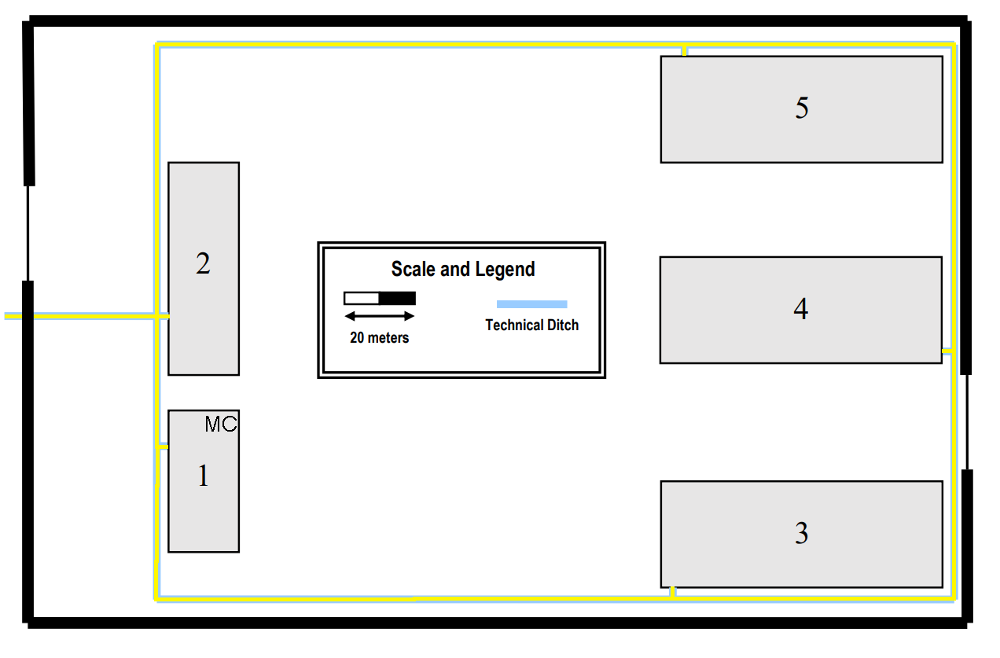

####Scale
```
 1.2cm -> 20 meters
 1cm -> 16.66666667 meters

 Area of room 
 1cm --- 16.66666667 meters 
 measure --- x

<=> (x = measure *  16.66666667)/1

```

- The building 1 horizontal dimensions are, approximately, 40 x 20 meters.
- The building 2 horizontal dimensions are, approximately, 60 x 20 meters.
- Buildings 3 and 4 horizontal dimensions are, approximately, 80 x 30 meters.

- We use monomode optical fiber in the cabling backbone.

- We use a total of meters of optical fiber in the backbone.