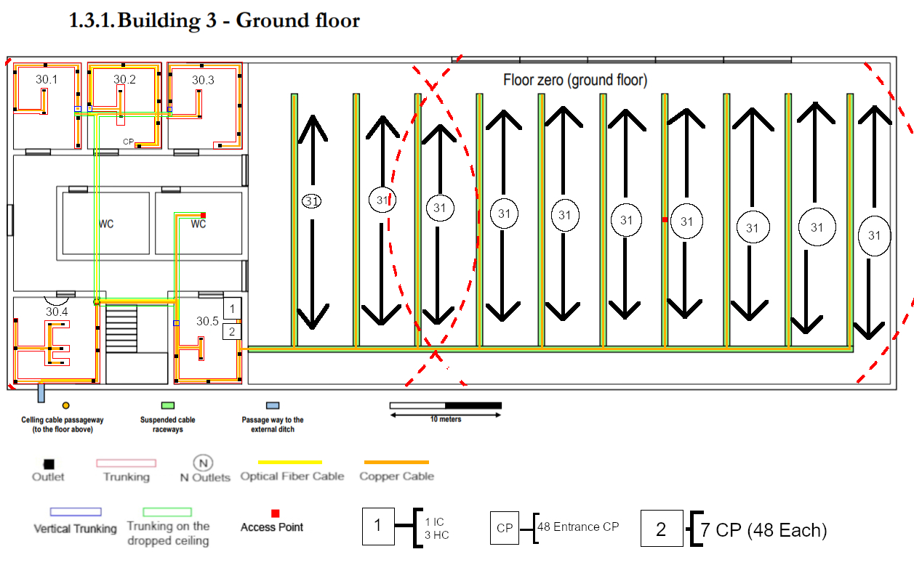
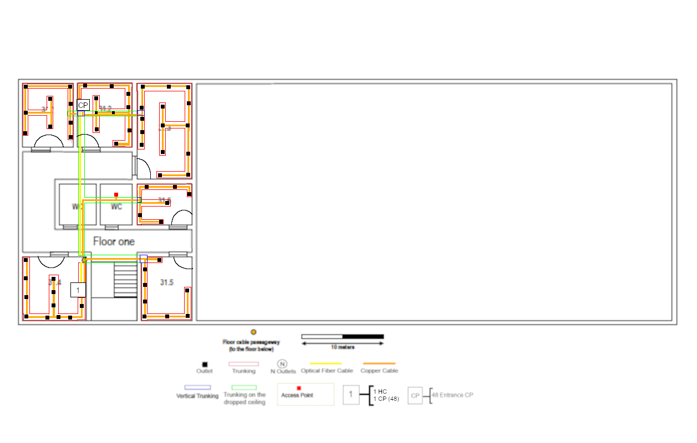

RCOMP 2020-2021 Project - Sprint 1 - Member 1191421 folder
===========================================

## Building 3 ####
##### Luís Neves - 1191421 ###

###Building 3 - Ground Floor


####Scale
```
 2cm -> 10 meters
 1cm -> 5 meters

 Area of room 
 1 --- 5
 measure --- x

<=> (x = measure * 5)/1
```

## Floor inventory

>#####For every length of cable calculated, it was taken into account the correct scale and necessary cable lenght inside telecomunication enclosures.


* ####Copper Cabble (T-568A)
>13 300 for the big room on the right.
>
>650 meters for the rest of the rooms on the ground floor
> #####13 950 meters total
* ####Fibre Cable
>Taking into consideration the redundacy needed to ensure safety and continuous signal to the building itself, twice the amount of fibre cable will be requested. 
>
>As so, to make every connection and keep them redundant, **190 meters** of fibre cable will be necessary.
* ####Floor Trunking
>This type of trunking should be rounded, to prevent accidents in the various rooms it is placed in.
>
>#####130 meters
* ####Dropped Ceiling Trunking
>On the contrary of the floor trunking, this can be a type of trunking to the client's choice, as it is going to remain hiden.
>
>#####50 meters
* ####Vertical Trunking
>Again, this type of trunking is to the client's taste, as it is meant to stay on the wall and should not cause much trouble.
>
>#####10 meters
* ####Access points
>The access points will be responsible for providing wireless internet coverage of the entire floor.
>
>The type of access point used provides a reach of 50 meters around it, as so, only 2 were necessary to cover the building. 
>However, it would be advised (for a stronger connection ground wide) to use more AP's with smaller but stronger connection power.
>
>#####Total = 2 Access Points
* ####Outlets
>Following the industry standards, for the big room on the right, the client will need 310 outlets.
>
>For the rest of the rooms on the ground floor the client will need to purchase 44 outlets for user use and one more for the Access Point.
>#####355 Outlets in total
* ####Telecomunication Enclosures
>For this floor, there will be 3 telecomunication enclosures.
>
>There are 2 Telecomunication Enclosures in room 30.5.
>
> **Number 1** will hold 4 devices (4 24 patch panels for the IC and HC's), so, it's size will be 6 * 4 U (S) = **24U**.
>
> **Number 2** will hold 7 devices (7 48 patch panels for the CP's), it's size will be 6 * 14 (patch panels with 48 entrances ocupy 2U) = **84U**.
>
>There is also a telecomunication enclosure in room 30.2, this one holds a single CP with a 48 patch panel.
>So it's size is 6 * 2 U = **12U**
>
>#####TE #1 -> 24U
>#####TE #2 -> 84U
>#####TE #3 -> 12U

###To sum up and explain every connection and decision made, 
This floor is made up of 1 IC, 3 HC's and 8 CP's. The first HC is directly connected to
the outlets, the second one outputs fiber cable and connects to the TE holding the 7 CP's
responsible for feeding the big and open room on the right, finally, the last HC connects to
the last CP in room 30.2 to power the outlets on that side of the building. 
Every fiber connection was made using redundancy to ensure good connection.


###Building 3 - First Floor
 
 
 ## Floor inventory

* ####Copper Cabble (T-568A)
>For all the rooms in the first floor.
> #####600 meters total
* ####Fibre Cable
>Taking into consideration the redundacy needed to ensure safety and continuous signal to the building itself, twice the amount of fibre cable will be requested. 
>
>As so, to make every connection and keep them redundant, **40 meters** of fibre cable will be necessary.
* ####Floor Trunking
>This type of trunking should be rounded, to prevent accidents in the various rooms it is placed in.
>
>#####150 meters
* ####Dropped Ceiling Trunking
>On the contrary of the floor trunking, this can be a type of trunking to the client's choice, as it is going to remain hiden.
>
>#####40 meters
* ####Vertical Trunking
>Again, this type of trunking is to the client's taste, as it is meant to stay on the wall and should not cause much trouble.
>
>#####12,5 meters
* ####Access points
>The access points will be responsible for providing wireless internet coverage of the entire floor.
>
>The type of access point used provides a reach of 50 meters around it, as so, only 1 was necessary to cover the building. 
>However, it would be advised (for a stronger connection ground wide) to use more AP's with smaller but stronger connection power.
>
>#####1 Access Point
* ####Outlets
>Following the industry standards, for this floor 60 outlets are required, being that one of them is for the Access Point.
>#####60 Outlets in total
* ####Telecomunication Enclosures
>For this floor, there will be 2 telecomunication enclosures.
>
>**Number 1** (Room 31.4) will hold 2 devices (1 24 patch panel for the HC and 1 48 patch panel for the CP), so, it's size will be 6 * 3U (S) = **18U**.
>
>**Number 2** (Room 31.2) will hold 1 device (1 48 patch panels for the CP), it's size will be 6 * 2U (48 patch panels ocuppy 2U) = **12U**.
>
>#####To sum up, 
>#####TE #1 -> 18U
>#####TE #2 -> 12U

###To sum up and explain every connection and decision made,
This floor is considerably smaller and easier to route. There is a HC and 
a CP in room 31.4, this CP powers 3 rooms and the Access Point to divide the amount of outlets each CP handles.
The second CP is in room 31.2 and it feeds the remaining 3 rooms.

#Full inventory

####Copper Cable 
> **14 545 meters of S/UTP protected cable**
>
> **7,50 meters of S/STP protected cable** 
####Fiber Cable
> **230 meters**
####Floor Trunking
> **280 meters**
####Vertical Trunking
> **22,50 meters**
####Dropped Ceiling Trunking
> **90 meters**
####Access Points
> **3 Access Points**
####Outlets
> **415 outlets**
####Telecomunication Enclosures
> **5 total telecomunication enclosures**
>
>**Floor 0 - room 30.5 - TE 1 - 24U**  
>
>**Floor 0 - room 30.5 - TE 2 - 84U**
>
>**Floor 0 - room 30.2 - TE 3 - 12U**
>
>**Floor 1 - room 31.4 - TE 4 - 18U**
>
>**Floor 1 - room 31.2 - TE 5 - 12U**


###Demonstration of calculations regarding the number of network outlets for each room

####Ground Floor
>**Room 30.1**
>   >1.3cm x 1.5cm
>   ><=>6.5 x 7.5 <=> 48,75 m2
>
>
>######9 Outlets

>**Room 30.2**
>   >1.3cm x 1.5cm
>   ><=>6.5 x 7.5 <=> 48,75 m2
>
>######9 Outlets


>**Room 30.3**
 >   >1.3cm x 1.5cm
 >   ><=>6.5 x 7.5 <=> 48,75 m2
 >
 >
 >######9 Outlets

>**Room 30.4**
 >   >1.6cm x 1.6cm
 >   ><=>8 x 8 <=> 64 m2
 >
 >
 >######12 Outlets

>**Room 30.5**
 >   >1.2cm x 1.5cm
 >   ><=>6 x 7.5 <=> 48,75 m2
 >
 >
 >######9 Outlets

>**Big Open Room**
 >   >11cm x 5.7cm
 >   ><=>55 x 28.5 <=> 1567.5 m2
 >
 >
 >######310 Outlets

####First Floor

>**31.1**
 >   >1.2cm x 1.5cm
 >   ><=>6 x 7.5 <=> 48.75 m2
 >
 >
 >######9 Outlets

>**31.2**
 >   >1.3cm x 1.5cm
 >   ><=>6.5 x 7.5 <=> 49 m2
 >
 >
 >######10 Outlets

>**31.3**
 >   >2.3cm x 1.3cm
 >   ><=>11.5 x 6.55 <=> 74.75 m2
 >
 >
 >######15 Outlets

>**31.4**
 >   >1.5cm x 1.5cm
 >   ><=>7.5 x 7.5 <=> 56.25 m2
 >
 >
 >######11 Outlets

>**31.5**
 >   >1.2cm x 1.5cm
 >   ><=>6 x 7.5 <=> 48.75 m2
 >
 >
 >######9 Outlets