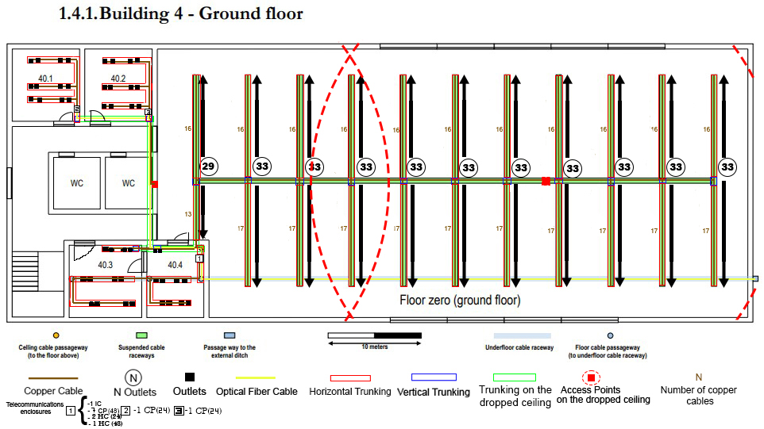
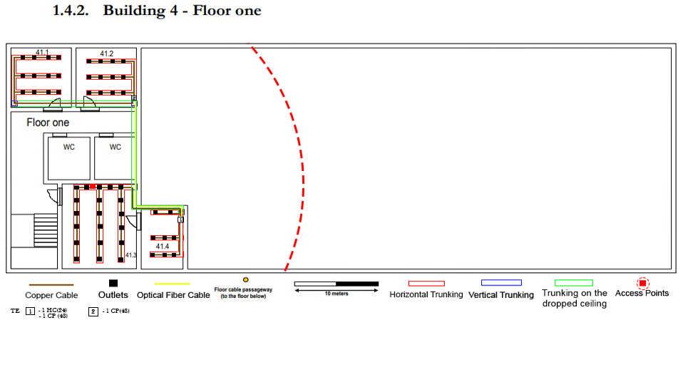

RCOMP 2020-2021 Project - Sprint 1 - Member 1200625 folder
===========================================

## Building 4 ####
##### Sérgio Lopes - 1200625 ###

###Building 4 - Ground Floor


####Scale
```
 2.6cm -> 5 meters
 5.2cm -> 10 meters
 
 Conversion from cm to m
 5.2 --- 10
 measure --- x

<=> (x = measure * 5)/1
```

##Demonstration of calculations regarding the number of network outlets for each room and their areas
###(All calculations were rounded up so that nothing was missing)

>**Room 40.1**
>   >3.8cm * 4cm
>   ><=> 7.31m * 7.69m = 56.21
>
>   >56.21/10*2 ~= 12
>
>#####Area of the room is 56.21 m^2 and 12 Outlets

>**Room 40.2**
>   >3.8cm * 4cm
>   ><=>7.31m * 7.69m = 56.21
>
>   >56.21/10*2 ~= 12
>
>#####Area of the room is 56.21 m^2 and 12 Outlets

>**Room 40.3**
>   >4cm * 4cm
>   ><=> 7.69m * 7.69m = 59,14
> 
>   >59.14/10*2 ~= 12
> 
>#####Area of the room is 59.14 m^2 and 12 Outlets

>**Room 40.4**
>   >3.2cm * 4cm 
>   ><=> 6.15m * 7.69m = 47.29
> 
>   >47.29/10*2 ~= 10
> 
>#####Area of the room is 47.29 m^2 and 10 Outlets

>**Big Open Room**
>   >30cm * 15.1cm+10.7cm * 2.9cm
>   ><=> 57.69m * 29.04m + 20.58m * 5.58m = 1675.32m^2 + 114.84m^2 = 1790.16m^2
> 
>   >1790.16/10*2 ~= 359
> 
>#####Area of the room is 1790.16 m^2 and 359 Outlets

# Floor inventory

>#####For every length of cable calculated, it was taken into account the correct scale and necessary cable lenght inside telecomunication enclosures.


* ####Copper Cabble (T-568A)
>30000 for the big room on the right.
>
>320 meters for the rest of the rooms on the ground floor
> #####30320 meters total
* ####Fibre Cable
>Taking into consideration the redundacy needed to ensure safety and continuous signal to the building itself, twice the amount of fibre cable will be requested.
>
>As so, to make every connection and keep them redundant, **152 meters** of fibre cable will be necessary.
* ####Floor Trunking
>This type of trunking should be rounded, to prevent accidents in the various rooms it is placed in.
>
>#####130 meters
* ####Dropped Ceiling Trunking
>On the contrary of the floor trunking, this can be a type of trunking to the client's choice, as it is going to remain hiden.
>
>#####50 meters
* ####Vertical Trunking
>Again, this type of trunking is to the client's taste, as it is meant to stay on the wall and should not cause much trouble.
>
>#####10 meters
* ####Access points
>The access points will be responsible for providing wireless internet coverage of the entire floor.
>
>The type of access point used provides a reach of 50 meters around it, as so, only 2 were necessary to cover the building.
>However, it would be advised (for a stronger connection ground wide) to use more AP's with smaller but stronger connection power.
>
>#####Total = 2 Access Points
* ####Outlets
>Following the industry standards, for the big room on the right, the client will need 310 outlets.
>
>For the rest of the rooms on the ground floor the client will need to purchase 44 outlets for user use and one more for the Access Point.
>#####407 Outlets in total
* ####Telecomunication Enclosures
>For this floor, there will be 3 telecomunication enclosures.
>
>There are 2 Telecomunication Enclosures in room 30.5.
>
> **Number 1** will hold 10 devices (3 24 patch panels for the IC and some HC's and 7 48 patch panels for the CP's and one HC), so, it's size will be 6 * 17 U (S) = **102U**.
>
> **Number 2** will hold 1 device (1 24 patch panel for the CP), it's size will be 6 * 1 = **6U**.
>
> **Number 3** will hold 1 device (1 24 patch panel for the CP), it's size will be 6 * 1 = **6U**.
>
>#####TE #1 -> 102U
>#####TE #2 -> 6U
>#####TE #3 -> 6U


###Building 4 - Floor one


####Scale
```
 2.6cm -> 5 meters
 5.2cm -> 10 meters
 
 Conversion from cm to m
 5.2 --- 10
 measure --- x

<=> (x = measure * 5)/1
```

##Demonstration of calculations regarding the number of network outlets for each room and their areas
###(All calculations were rounded up so that nothing was missing)

>**Room 41.1**
>   >3.7cm * 4.1cm 
>   ><=> 7.12m * 7.89m = 56.18m^2
> 
>   >56.18/10*2 ~= 12
> 
>#####Area of the room is 56.18 m^2 and 12 Outlets

> **Room 41.2**
>   >3.7cm * 4.1cm
>   ><=> 7.12m * 7.89m = 56.18m^2
> 
>   >56.18/10*2 ~= 12
> 
>####Area of the room is 56.18 m^2 and 12 Outlets

> **Room 41.3**
>   >5.8cm * 4.6cm
>   ><=> 11.16m*8.85m = 98.77m^2
> 
>   >98.77/10*2 ~= 20
> 
>####Area of the room is 98.77 m^2 and 20 Outlets

>**Room 41.4**
>   >2.6cm * 4.1cm
>   ><=> 5m*7.89m = 39.45m^2
> 
>   >39.45/10*2 ~= 8
> 
>####Area of the room is 39.45 m^2 and 8 Outlets

###Total area 250,58 m^2

## Floor inventory

>#####For every length of cable calculated, it was taken into account the correct scale and necessary cable lenght inside telecomunication enclosures.


* ####Copper Cabble (T-568A)
> 450 meters for the rooms.
> ##### meters total
* ####Fibre Cable
>Taking into consideration the redundacy needed to ensure safety and continuous signal to the building itself, twice the amount of fibre cable will be requested. 
>
>As so, to make every connection and keep them redundant, **15 meters** of fibre cable will be necessary.
* ####Floor Trunking
>This type of trunking should be rounded, to prevent accidents in the various rooms it is placed in.
>
>#####50meters
* ####Dropped Ceiling Trunking
>On the contrary of the floor trunking, this can be a type of trunking to the client's choice, as it is going to remain hiden.
>
>#####15 meters
* ####Vertical Trunking
>Again, this type of trunking is to the client's taste, as it is meant to stay on the wall and should not cause much trouble.
>
>#####10 meters
* ####Access points
>The access points will be responsible for providing wireless internet coverage of the entire floor.
>
>The type of access point used provides a reach of 50 meters around it, as so, only 2 were necessary to cover the building. 
>However, it would be advised (for a stronger connection ground wide) to use more AP's with smaller but stronger connection power.
>
>#####Total = 1 Access Points
* ####Outlets
>Following the industry standards, for the big room on the right, the client will need 310 outlets.
>
>For the rest of the rooms on the ground floor the client will need to purchase 44 outlets for user use and one more for the Access Point.
>#####52 Outlets in total
* ####Telecomunication Enclosures
>For this floor, there will be 2 telecomunication enclosures.
>
>
> **Number 1** will hold 2 devices (1 24 patch panel for the HC and one 48 pathc panel for the CP, so, it's size will be 6 * 3 U (S) = **18U**.
>
> **Number 2** will hold 1 device (1 48 patch panel for the CP), it's size will be 6 * 2 = **12U**.
>
>#####TE #1 -> 18U
>#####TE #2 -> 12U
