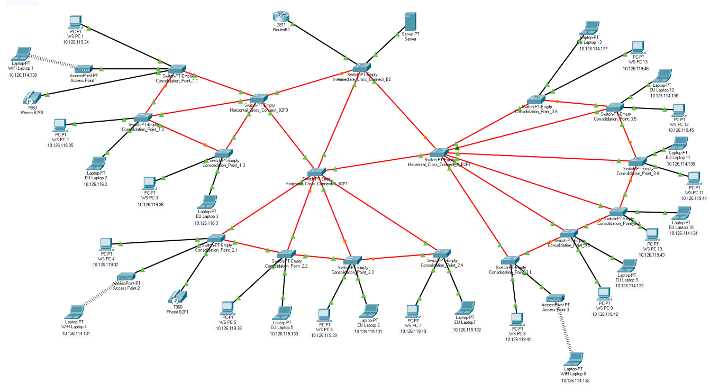

RCOMP 2019-2020 Project - Sprint 2 - Member 1181597 folder
===========================================
(This folder is to be created/edited by the team member 1181597 only)

# Building 2 #

## Technical decisions ##

### VLAN devices configuration ###
**VLAN IDs to be used: 328 , 330 , 331 , 341 , 345

* 
* VLAN for all end-user outlets on the ground floor: 331
* VLAN for all end-user outlets on floor one of the building: 330
* VLAN for the Wi-Fi network (for all access-points’ outlets within the building): 328
* VLAN for the building DMZ(for servers,administration workstations,and industrial machines): 345
* VLAN for VoIP (for IP-phones): 341

#### End user outlets on the ground floor: 6 nodes ####
* Network in CIDR notation: 10.126.116.0/26
* Network’s first valid node address: 10.126.116.1
* Network’s last valid node address:  10.126.116.62
* Network mask: (1111 1111).(1111 1111).(1111 1111).(1100 0000) = 255.255.255.192
* Broadcast address: 10.126.116.63

#### End user outlets on floor one: 70 nodes ####
* Network in CIDR notation: 10.126.115.128/25
* Network’s first valid node address: 10.126.115.129
* Network’s last valid node address:  10.126.115.254
* Network mask: (1111 1111).(1111 1111).(1111 1111).(1000 0000) = 255.255.255.128
* Broadcast address: 10.126.115.255

#### Wi-Fi network: 100 nodes ####
* Network in CIDR notation: 10.126.114.128/25
* Network’s first valid node address: 10.126.114.129
* Network’s last valid node address: 110.126.114.254
* Network mask: (1111 1111).(1111 1111).(1111 1111).(1000 0000) = 255.255.255.128  
* Broadcast address: 110.126.114.255

#### Local servers, administration workstations, and machines (DMZ): 12 nodes ####
* Network in CIDR notation: 10.126.119.32/28
* Network’s first valid node address: 10.126.119.33
* Network’s last valid node address: 10.126.119.47
* Network mask: (1111 1111).(1111 1111).(1111 1111).(1111 0000) = 255.255.255.240
* Broadcast address: 10.126.119.48

#### VoIP (IP-phones): 35 nodes ####
* Network in CIDR notation: 10.126.118.128/26
* Network’s first valid node address: 10.126.118.129
* Network’s last valid node address: 10.126.118.190
* Network mask: (1111 1111).(1111 1111).(1111 1111).(1100 0000) = 255.255.255.192  
* Broadcast address: 10.126.118.191

### Trunking and Access between layer 2 devices and end users ###
With all the switches defined as client or server, we now had access to the defined VLANs in every switch. As so, depending on the end user type, the Fast Ethernet cord was configured into Access mode and selected the correct VLAN for the end device.

Furthermore, between switches, to ensure that every switch knew every VLAN available, the connection between them was in trunk mode.
### Access Point Channels ###

Taking into consideration that **Building 3** had **3** total Access Points, different channels had to be configured for the 2.4Ghz port.
As so, the first AP was assigned with channel **number 1**, the second with **number 6** and the last with **number 9**

To ensure correct connection from the AP to the Wireless Laptops, the APs were organized and distributed acordingly on the Physical part of the project

## CLI commands ##
### VTP mode client ###
* enable
* configure terminal
* vtp mode client
### VTP mode server ###
* enable
* configure terminal
* vtp mode server

### VoIP phones VLAN ###
* enable
* configure terminal
* interface fastEthernet (...)
* switchport mode access
* no switchport access vlan
* switchport voice vlan 341

### VTP domain name ###
* enable
* configure terminal
* vtp domain rcompdlg3

### Sub-interfaces ###

#### Wi-Fi network #### 
* enable
* configure terminal
* interface FastEthernet 0/0.1
* encapsulation dot1Q 328
* ip address 10.126.114.129 255.255.255.128
* no shutdown
* exit

#### End user outlets on the floor one####
* enable
* configure terminal	
* interface FastEthernet 0/0.2
* encapsulation dot1Q 330
* ip address 10.126.115.129 255.255.255.128
* no shutdown
* exit

#### End user outlets on ground floor  ####
* enable
* configure terminal
* interface FastEthernet 0/0.3
* encapsulation dot1Q 331
* ip address 10.126.116.1 255.255.255.192
* no shutdown
* exit

#### Local servers, administration workstations, and machines (DMZ) ####
* enable
* configure terminal
* interface FastEthernet 0/0.4
* encapsulation dot1Q 345
* ip address 10.126.118.129 255.255.255.192
* no shutdown
* exit

#### VoIP (IP-phones) ####
* enable
* configure terminal
* interface FastEthernet 0/0.5
* encapsulation dot1Q 341
* ip address 10.126.119.33 255.255.255.240
* no shutdown
* exit

## Network Simulation ##

| **Network Simulation on Building 2** |                                       
|:-----------------------|
||