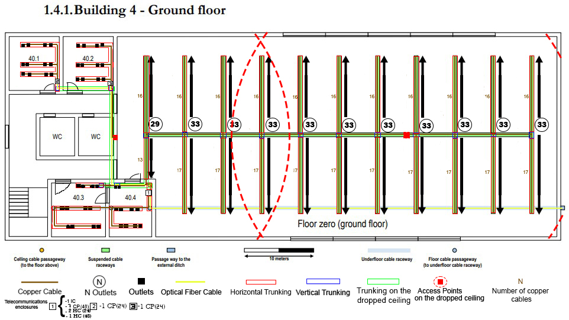
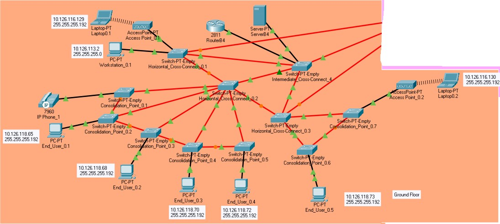
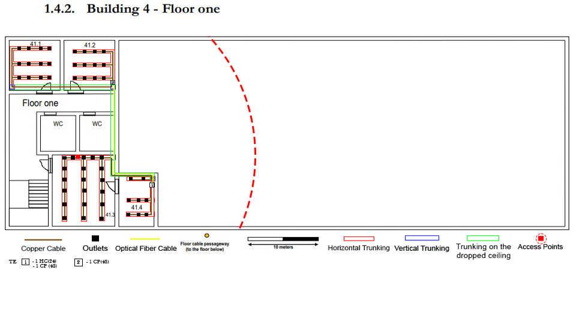
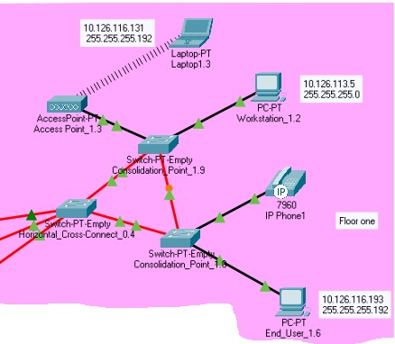

RCOMP 2020-2021 Project - Sprint 2 - Member 1200625 folder
===========================================
(This folder is to be created/edited by the team member 1200625 only)

# Building 4 #

## Technical decisions ##

### VLAN devices configuration (Using the rule to start to assign to for those with more nodes) ###

**VLAN IDs to be used:**

* VLAN for the building DMZ (for servers, administration workstations, and industrial machines): 326
* VLAN for the Wi-Fi network (for all access-points’ outlets within the building): 333
* VLAN for all end-user outlets on floor one: 334
* VLAN for all end-user outlets on the ground floor: 340
* VLAN for VoIP (for IP-phones): 342

### Router IPv4 node address ###

* 10.126.114.4 *

#### Local servers, administration workstations, and machines (DMZ): 250 nodes ####

* Network in CIDR notation: 10.126.113.0/24
* Network’s first valid node address: 10.126.113.1
* Network’s last valid node address: 10.126.113.254
* Network mask = 255.255.255.0
* Broadcast address: 10.126.113.255

#### Wi-Fi network: 60 nodes ####

* Network in CIDR notation: 10.126.116.128/26
* Network’s first valid node address: 10.126.116.129
* Network’s last valid node address: 10.126.116.190
* Network mask = 255.255.255.192
* Broadcast address: 10.126.116.191

#### End user outlets on floor one: 50 nodes ####
* Network in CIDR notation: 10.126.116.192/26
* Network’s first valid node address: 10.126.116.193
* Network’s last valid node address: 10.126.116.254
* Network mask = 255.255.255.192
* Broadcast address: 10.126.116.255

#### End user outlets on the ground floor: 40 nodes ####
* Network in CIDR notation: 10.126.118.64/26
* Network’s first valid node address: 10.126.118.65
* Network’s last valid node address: 10.126.118.126
* Network mask = 255.255.255.192
* Broadcast address: 10.126.118.127

#### VoIP (IP-phones): 25 nodes ####
* Network in CIDR notation: 10.126.118.192/27
* Network’s first valid node address: 10.126.118.193
* Network’s last valid node address: 10.126.118.222
* Network mask = 255.255.255.224
* Broadcast address: 10.126.118.223

### Access Point Channels ###

Taking into consideration that **Building 4** had **3** total Access Points, 
different channels had to be configured for the 2.4Ghz port.
As so, the first AP was assigned with channel **number 3**, 
the second with **number 6** and the last with **number 9**

To ensure correct connection from the AP to the Wireless Laptops, the APs were organized
and distributed acordingly on the Physical part of the project

## CLI commands ##

### VTP mode server (to ICC) ###
* enable
* config t
* vtp mode server

### VTP mode client (to HCC and CP) ###
* enable
* config t
* vtp mode client

### VoIP phones VLAN ###
* enable
* config t
* interface fastEthernet (...)
* switchport mode access
* no switchport access vlan
* switchport voice vlan 342

### VTP domain name ###
* enable
* config t
* vtp domain rcompdlg3

### Sub-interfaces ###

#### Local servers, administration workstations, and machines (DMZ) ####
* enable
* config t
* interface FastEthernet 0/0.1
* encapsulation dot1Q 326
* ip address 10.126.113.254 255.255.255.0
* no shutdown
* exit

#### Wi-Fi network ####
* enable
* config t
* interface FastEthernet 0/0.2
* encapsulation dot1Q 333
* ip address 10.126.116.190 255.255.255.192
* no shutdown
* exit

#### End user outlets on floor one ####
* enable
* config t
* interface FastEthernet 0/0.3
* encapsulation dot1Q 334
* ip address 10.126.116.254 255.255.255.192
* no shutdown
* exit

#### End user outlets on the ground floor ####
* enable
* config t
* interface FastEthernet 0/0.4
* encapsulation dot1Q 340
* ip address 10.126.118.126 255.255.255.192
* no shutdown
* exit

#### VoIP (IP-phones) ####
* enable
* config t
* interface FastEthernet 0/0.5
* encapsulation dot1Q 342
* ip address 10.126.118.222 255.255.255.224
* no shutdown
* exit

## Equipment instructions ##

### Equipment ###

* Laptop-PT;
* PC-PT (for workstations and End User);
* Access-Point-PT;
* Router (2811);
* Switch-PT-Empty (for ICC, HCC and CP);
* Server-PT;
* IP Phone (7960).

### Trunking and Access between layer 2 devices and end users ###
With all the switches defined as client or server, we now had access to the defined VLANs in every switch. As so, depending on the end user type, the Fast Ethernet cord was configured into Access mode and selected the correct VLAN for the end device.

Furthermore, between switches, to ensure that every switch knew every VLAN available, the connection between them was in trunk mode.
### Access Point Channels ###

Taking into consideration that **Building 4** had **3** total Access Points, different channels had to be configured for the 2.4Ghz port. 
As so, the first AP was assigned with channel **number 3**, the second with **number 6** and the last with **number 9**

To ensure correct connection from the AP to the Wireless Laptops, the APs were organized and distributed acordingly on the Physical part of the project

### Switches Ports ###

* PT-SWITCH-NM-1CFE Module for copper connections to end users;
* PT-SWITCH-NM-1FFE Module for fiber connections to connect switches;
* PT-SWITCH-NM-COVER is a cover plate that provides protection for the internal eletronic components. It also
helps maintain adequate cooling by normalizing airflow.

## Structured cable design ##
### Ground Floor ###
| **Cabling Project** | **Network Simulation** |                                       
|:--------------------|:-----------------------|
| |    

### Floor one ###
| **Cabling Project** | **Network Simulation** |                                       
|:--------------------|:-----------------------|
| |   |