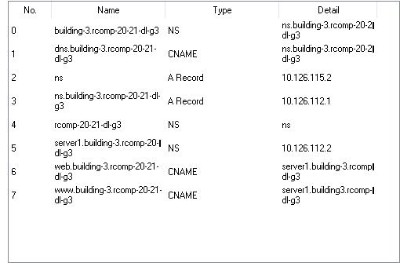

RCOMP 2020-2021 Project - Sprint 3 - Member 1191421 
===========================================

# Building 3 #

## Technical decisions ##

### VLAN devices configuration ###
**VLAN IDs to be used: 325 - 255**

* VLAN for the building DMZ (for servers, administration workstations, and industrial machines) (B3_DMZ_250N): **325**
* VLAN for the Wi-Fi network (for all access-points’ outlets within the building) (B3_WIFI_60N): **332** 
* VLAN for all end-user outlets on floor one of the building (B3_END_USER_F1_44N): **335**
* VLAN for all end-user outlets on the ground floor (B3_END_USER_F0_40N): **338**
* VLAN for VoIP (for IP-phones) (B3_VoIP_40N): **339**

### Router IPv4 Address ###

The router belongs to the backbone VLAN 

It's IP address is **10.126.114.3**

### ISP router IPv4 node address ###

* 120.57.201.209/30

#### Local servers, administration workstations, and machines (DMZ): 250 nodes ####
* Network in CIDR notation: 10.126.112.0/24
* Network’s first valid node address: 10.126.112.1
* Network’s last valid node address: 10.126.112.254 
* Network mask: (1111 1111).(1111 1111).(1111 1111).(0000 0000) = 255.255.255.0
* Broadcast address: 10.126.112.255

#### Wi-Fi network: 60 nodes ####
* Network in CIDR notation: 10.126.116.64/26
* Network’s first valid node address: 10.126.116.65
* Network’s last valid node address: 10.126.116.126 
* Network mask: (1111 1111).(1111 1111).(1111 1111).(1100 0000) = 255.255.255.192
* Broadcast address: 10.126.116.127

#### End user outlets on floor one: 44 nodes ####
* Network in CIDR notation: 10.126.117.0/26
* Network’s first valid node address: 10.126.117.1
* Network’s last valid node address: 10.126.117.62 
* Network mask: (1111 1111).(1111 1111).(1111 1111).(1100 0000) = 255.255.255.192 
* Broadcast address: 10.126.117.63

#### End user outlets on the ground floor: 40 nodes ####
* Network in CIDR notation: 10.126.117.192/26
* Network’s first valid node address: 10.126.117.193
* Network’s last valid node address: 10.126.117.254 
* Network mask: (1111 1111).(1111 1111).(1111 1111).(1100 0000) = 255.255.255.192  
* Broadcast address: 10.126.117.255

#### VoIP (IP-phones): 40 nodes ####
* Network in CIDR notation: 10.126.118.0/26
* Network’s first valid node address: 10.126.118.1
* Network’s last valid node address: 10.126.118.62 
* Network mask: (1111 1111).(1111 1111).(1111 1111).(1100 0000) = 255.255.255.192  
* Broadcast address: 10.126.118.63

## Device Configuration using CLI ##

### OSPF dynamic routing ###
* router ospf 1
*  network 10.126.112.0 0.0.0.255 area 3
*  network 10.126.116.64 0.0.0.63 area 3
*  network 10.126.117.0 0.0.0.63 area 3
*  network 10.126.117.192 0.0.0.63 area 3
*  network 10.126.118.0 0.0.0.63 area 3
  !

### DHCPv4 service ###
* ip dhcp pool B3_DMZ_250N
* network 10.126.112.0 255.255.255.0
* default-router 10.126.112.50
* dns-server 10.126.112.1
-----------------------------------------
* ip dhcp pool B3_END_USER_F0_40N
* network 10.126.117.192 255.255.255.192
* default-router 10.126.117.203
* dns-server 10.126.112.1
-----------------------------------------
* ip dhcp pool B3_END_USER_F1_44N
* network 10.126.117.0 255.255.255.192
* default-router 10.126.117.3
* dns-server 10.126.112.1
 ----------------------------------------- 
* ip dhcp pool B3_WiFi_60N
* network 10.126.116.64 255.255.255.192
* default-router 10.126.116.68
* dns-server 10.126.112.1
-----------------------------------------
* ip dhcp pool B1_VoIP_40N
* network 10.126.118.0 255.255.255.192
* default-router 10.126.118.1
* option 150 ip 10.126.118.1
* dns-server 10.126.112.1
-----------------------------------------

**Excluded addresses**
* ip dhcp excluded-address 10.126.112.50
* ip dhcp excluded-address 10.126.112.1
* ip dhcp excluded-address 10.126.112.2
* ip dhcp excluded-address 10.126.117.203
* ip dhcp excluded-address 10.126.117.3
* ip dhcp excluded-address 10.126.116.68
* ip dhcp excluded-address 10.126.118.1

### DNS ###

### NAT ###

* interface FastEthernet0/0
* ip address 10.126.114.3 255.255.255.128
* ip nat outside

---------------------------
* interface FastEthernet0/0.1
* encapsulation dot1Q 325
* ip address 10.126.112.50 255.255.255.0
* ip nat inside
------------------------------------
* router rip
* !
* ip nat inside source static tcp 10.126.112.2 80 10.126.114.3 80
*  ip nat inside source static tcp 10.126.112.2 443 10.126.114.3 443
*  ip nat inside source static tcp 10.126.112.1 53 10.126.114.3 53
*  ip nat inside source static udp 10.126.112.1 53 10.126.114.3 53

### VOIP CONFIGURATIONS ###

**CP 8**
* interface FastEthernet1/1
* switchport mode access
* switchport voice vlan 339

**CP 10**
* interface FastEthernet1/1
* switchport mode access
* switchport voice vlan 339

--------------------------
* dial-peer voice 1 voip
* destination-pattern 200..
* session target ipv4:10.126.118.129

* dial-peer voice 2 voip
* destination-pattern 300..
* session target ipv4:10.126.118.1

* dial-peer voice 3 voip
* destination-pattern 400..
* session target ipv4:10.126.118.222

* dial-peer voice 4 voip
* destination-pattern 100..
* session target ipv4:10.126.119.10

--------------
**telephony-service**
* max-ephones 2
* max-dn 20
* ip source-address 10.126.119.10 port 2000
* auto assign 1 to 2
* auto assign 1 to 20

* ephone-dn 1
* number 10001

* ephone-dn 2
* number 10002

* ephone 1
* device-security-mode none
* mac-address 00D0.58B9.B34A 
* type 7960
* button 1:2

* ephone 2
* device-security-mode none
* mac-address 00E0.A3B3.2094
* type 7960
* button 1:1

### Servers ###
**DNS**
* 10.126.112.1

**HTTP**
* 10.126.112.2