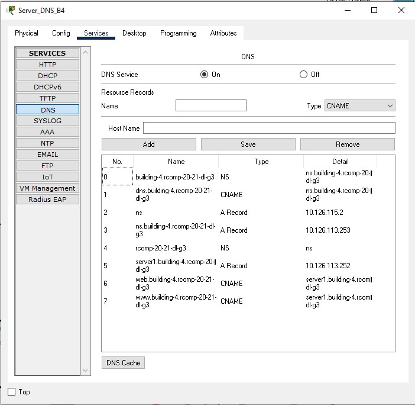

RCOMP 2020-2021 Project - Sprint 3 - Member 1200625 folder
===========================================
(This folder is to be created/edited by the team member 1200625 only)

# Building 4

##Technical decisions

### Vlan devices configuration
**VLAN IDs to be used: 326, 333, 334, 340, 342**

* VLAN for all end-user outlets on the ground floor: 340
* VLAN for all end-user outlets on floor one of the building: 334
* VLAN for the Wi-Fi network (for all access-points’ outlets within the building): 333
* VLAN for the building DMZ(for servers,administration workstations,and industrial machines): 326
* VLAN for VoIP (for IP-phones): 342

#### Local servers, administration workstations, and machines (DMZ): 250 nodes ####

* Network in CIDR notation: 10.126.113.0/24
* Network’s first valid node address: 10.126.113.1
* Network’s last valid node address: 10.126.113.254
* Network mask = 255.255.255.0
* Broadcast address: 10.126.113.255

#### Wi-Fi network: 60 nodes ####

* Network in CIDR notation: 10.126.116.128/26
* Network’s first valid node address: 10.126.116.129
* Network’s last valid node address: 10.126.116.190
* Network mask = 255.255.255.192
* Broadcast address: 10.126.116.191

#### End user outlets on floor one: 50 nodes ####
* Network in CIDR notation: 10.126.116.192/26
* Network’s first valid node address: 10.126.116.193
* Network’s last valid node address: 10.126.116.254
* Network mask = 255.255.255.192
* Broadcast address: 10.126.116.255

#### End user outlets on the ground floor: 40 nodes ####
* Network in CIDR notation: 10.126.118.64/26
* Network’s first valid node address: 10.126.118.65
* Network’s last valid node address: 10.126.118.126
* Network mask = 255.255.255.192
* Broadcast address: 10.126.118.127

#### VoIP (IP-phones): 25 nodes ####
* Network in CIDR notation: 10.126.118.192/27
* Network’s first valid node address: 10.126.118.193
* Network’s last valid node address: 10.126.118.222
* Network mask = 255.255.255.224
* Broadcast address: 10.126.118.223

##CLI commands

### OSPF dynamic routing
* router ospf 4
* log-adjacency-changes
* network 10.126.113.0 0.0.0.255 area 4
* network 10.126.116.128 0.0.0.63 area 4
* network 10.126.116.192 0.0.0.63 area 4
* network 10.126.118.64 0.0.0.63 area 4
* network 10.126.118.192 0.0.0.31 area 4

### DHCPv4 service

* ip dhcp pool B4_DMZ_250N
* network 10.126.113.0 255.255.255.0
* default-router 10.126.113.254
* dns-server 10.126.113.253
------------------------------------------------
* ip dhcp pool B4_WIFI_60N
* network 10.126.116.128 255.255.255.192
* default-router 10.126.116.190
* dns-server 10.126.113.253
------------------------------------------------
* ip dhcp pool B4_END_USER_F1_50N
* network 10.126.116.192 255.255.255.192
* default-router 10.126.116.254
* dns-server 10.126.113.253
------------------------------------------------
* ip dhcp pool B4_END_USER_F0_40N
* network 10.126.118.64 255.255.255.192
* default-router 10.126.118.126
* dns-server 10.126.113.253
------------------------------------------------
* ip dhcp pool B4_VoIP_25N
* network 10.126.118.192 255.255.255.224
* default-router 10.126.118.222
* option 150 ip 10.126.118.222
* dns-server 10.126.113.253
------------------------------------------------
**Excluded addresses**
* ip dhcp excluded-address 10.126.113.254
* ip dhcp excluded-address 10.126.113.252
* ip dhcp excluded-address 10.126.113.253
* ip dhcp excluded-address 10.126.116.190
* ip dhcp excluded-address 10.126.116.254
* ip dhcp excluded-address 10.126.118.126
* ip dhcp excluded-address 10.126.118.222

### DNS

### NAT

* interface FastEthernet0/0
* ip address 10.126.114.4 255.255.255.128
* ip nat outside
---------------------------------------
* interface FastEthernet0/0.1
* encapsulation dot1Q 326
* ip address 10.126.113.254 255.255.255.0
* ip nat inside
---------------------------------------
* router rip
* !
* ip nat inside source static tcp 10.126.113.252 80 10.126.114.4 80
* ip nat inside source static tcp 10.126.113.252 443 10.126.114.4 443
* ip nat inside source static tcp 10.126.113.253 53 10.126.114.4 53
* ip nat inside source static udp 10.126.113.253 53 10.126.114.4 53 

### VOIP CONFIGURATIONS
**Consolidation_Point_0.1**
* interface FastEthernet0/1
* switchport mode access
* switchport voice vlan 342

**Consolidation_Point_1.8**
* interface FastEthernet9/1
* switchport mode access
* switchport voice vlan 342

-----------------------------------
* dial-peer voice 2 voip
* destination-pattern 300..
* session target ipv4:10.126.118.1
------------------------------------
* dial-peer voice 3 voip
* destination-pattern 400..
* session target ipv4:10.126.118.222
------------------------------------
* dial-peer voice 4 voip
* destination-pattern 100..
* session target ipv4:10.126.119.10
------------------------------------
**Telephony-service**
* max-ephones 2
* max-dn 2
* ip source-address 10.126.118.222 port 2000
* auto assign 1 to 2
--------------------------------------------
* ephone-dn 1
* number 40001
-----------------------------------------
* ephone-dn 2
* number 40002
------------------------------------------
* ephone 1
* device-security-mode none
* mac-address 000A.F36E.D893
* type 7960
* button 1:1
--------------------------------------
* ephone 2
* device-security-mode none
* mac-address 0060.708D.6EB2
* type 7960
* button 1:2

### Servers

**DNS**
* 10.126.113.253

**HTTP**
* 10.126.113.252
